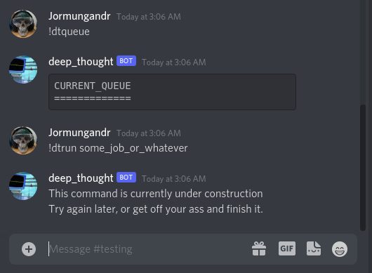

Well finals are over, and I'm finally free!

I'm gonna use this break to make as much progress on my collection of projects as I can, because looking at next semester, who knows when I'll get another chance?

I spent a lot of time today implementing changes to the software to run my cluster computer. It is now officially called deep_thought, and I changed the repo name to match. Currently, I am working on message passing to the main program. As a refresher, the manager has to be constantly running due to complications with the arduino and other requirements. As such, I have had to work out a way to implement methods of communication between the constantly running program and anything I might run that would query it or try and submit info to it.

This is easier said than done, but I have to say that I am a big fan of my implementation. The manager has a named pipe where it accepts information, then creates a new thread within itself to deal with the request, while accepting the next one. Each request is made with a random hex hash as an identifier, and that identifier is the name of another named pipe that was just created to accept a response. After the response is delivered, the hash pipe is deleted.

At the moment, I have the "api" as I'm calling it working to query the manager for information on current jobs, which the manager then returns. As I have not yet implemented the addition of jobs, the results are, of course, thrilling. But, it's something. And on top of that, I am able to get it to work from the command line as well as through the discord bot.

