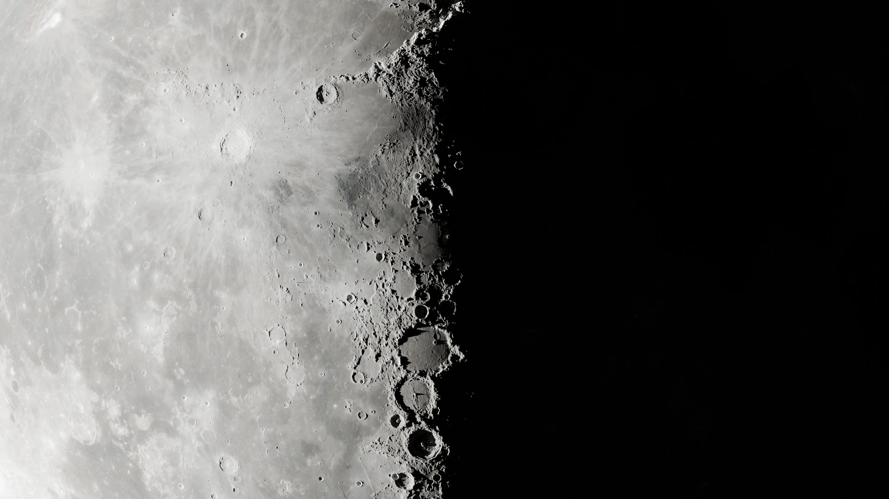

## boromir

**Start_Date:** 1/2024

**Status:** On-going

**Description:**
Building a Moon image renderer for optical navigation. Soon to be released free and open-source.

**Hardware:** None

**Software:** C,Python,Blender

**Pictures:**

**Related:**
