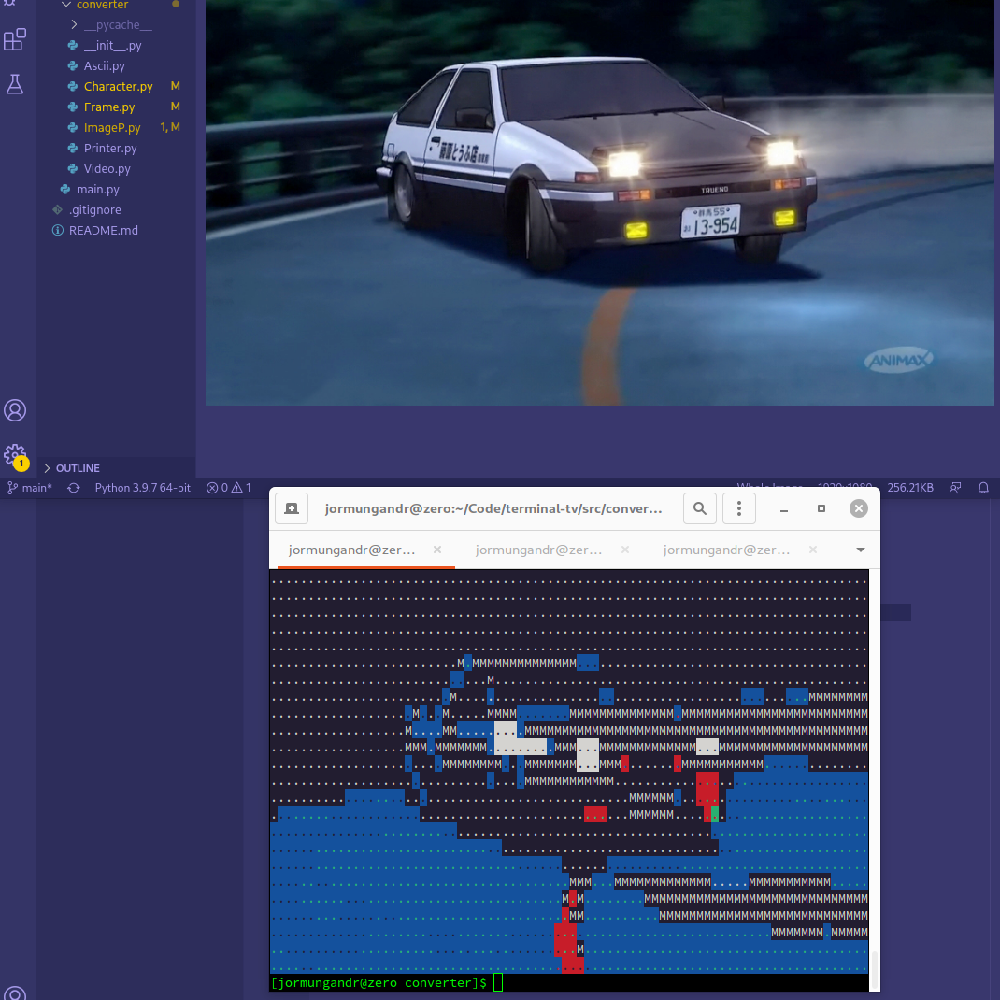
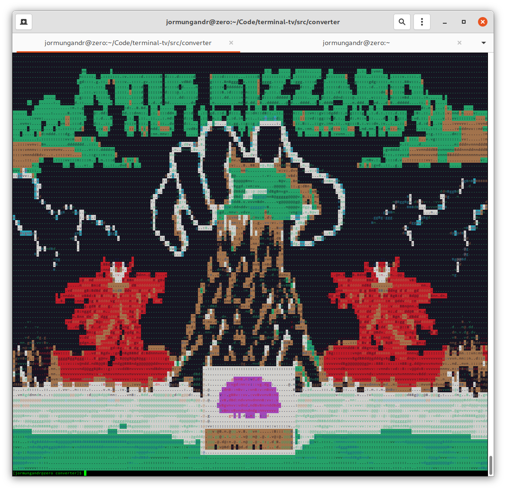

## terminal_tv

**Description:**

A Collaboration with [Vincent Rizzari](https://github.com/rizzarivincent) to try and convert videos into frames of ascii text to play in the terminal.

**Hardware:**

None.

**Software:**

[Repo](https://github.com/Jormungandr1105/terminal-tv)

**Pictures:**

**Related:**

[Ascii_Art](https://github.com/Jormungandr1105/Ascii_Art)

[Project-Pixel](https://github.com/Jormungandr1105/Project-Pixel)
